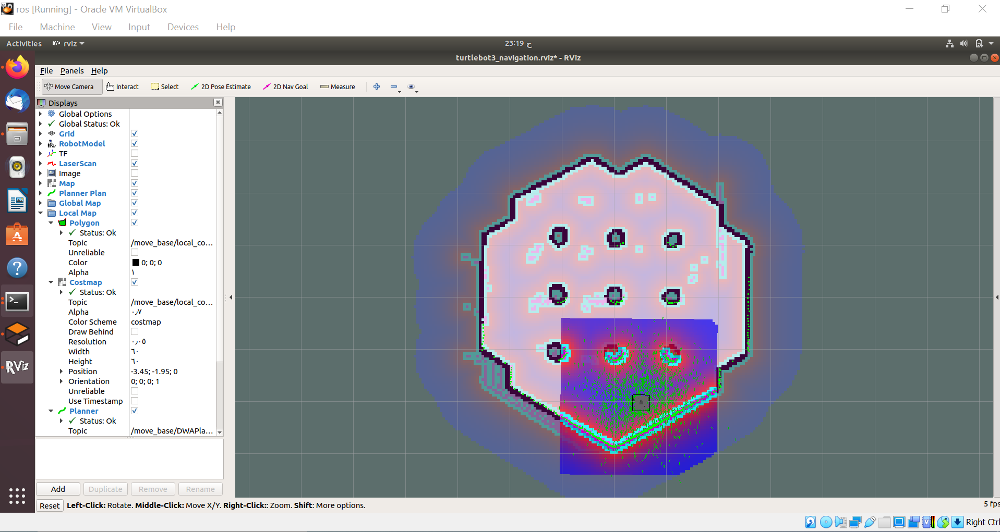
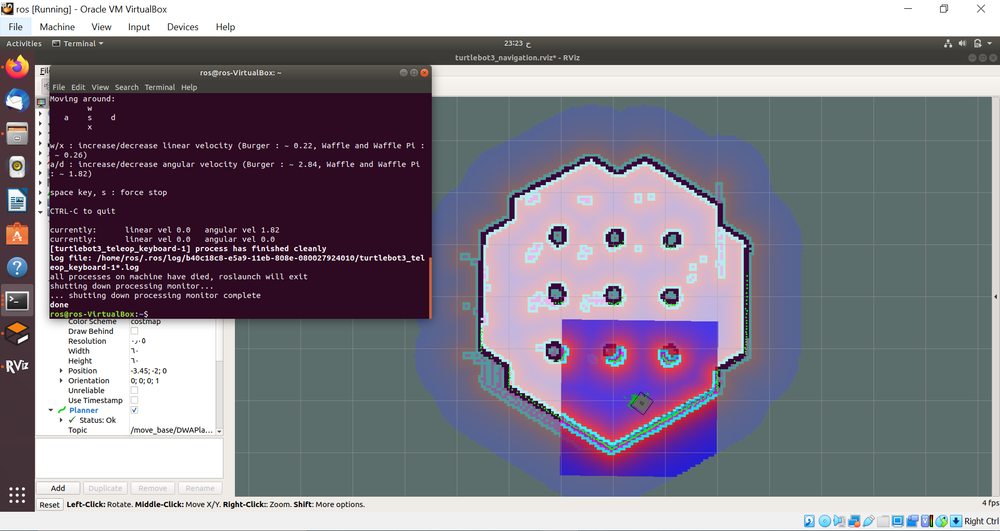

# Use-SLAM-map-to-launch-the-navigation
Use SLAM map with ROS to navigate the robot to a spacifc point defined by the user.

### Process:
1. Follow the steps in this link to produce the map: https://emanual.robotis.com/docs/en/platform/turtlebot3/slam_simulation/
2. Launch Gazebo:
```
$ export TURTLEBOT3_MODEL=waffle_pi
$ roslaunch turtlebot3_gazebo turtlebot3_world.launch
```
3. Run the navigation node on another terminal:
```
$ export TURTLEBOT3_MODEL=waffle_pi
$ roslaunch turtlebot3_navigation turtlebot3_navigation.launch map_file:=$HOME/map.yaml
```
4. Click the 2D Pose Estimate button in the RViz menu.
5. Click on the map where the actual robot is located and drag the large green arrow toward the direction where the robot is facing.
6. Repeat steps 1 and 2 until the LDS sensor data is overlayed on the saved map.



7. Launch keyboard teleoperation node:
```
roslaunch turtlebot3_teleop turtlebot3_teleop_key.launch
```
8. Move the robot back and forth a bit to collect the surrounding environment information until the tiny green dots become like this:


9. Close the keyboard teleoperation node.
10. Start navigating by clicking the " 2D Nav Goal " button, and select the position from RViz:

